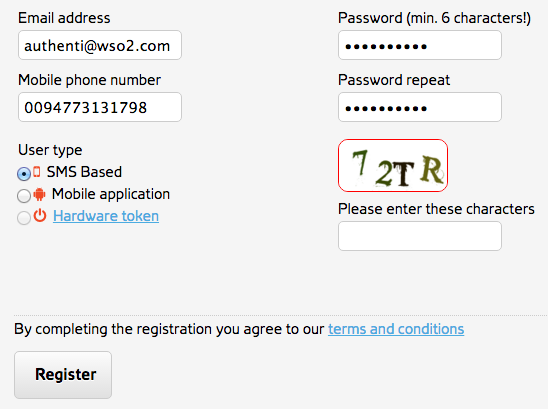
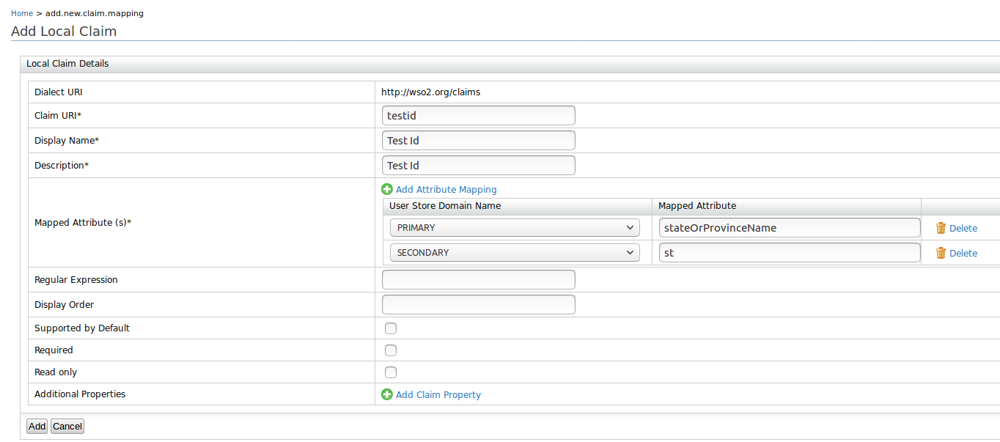
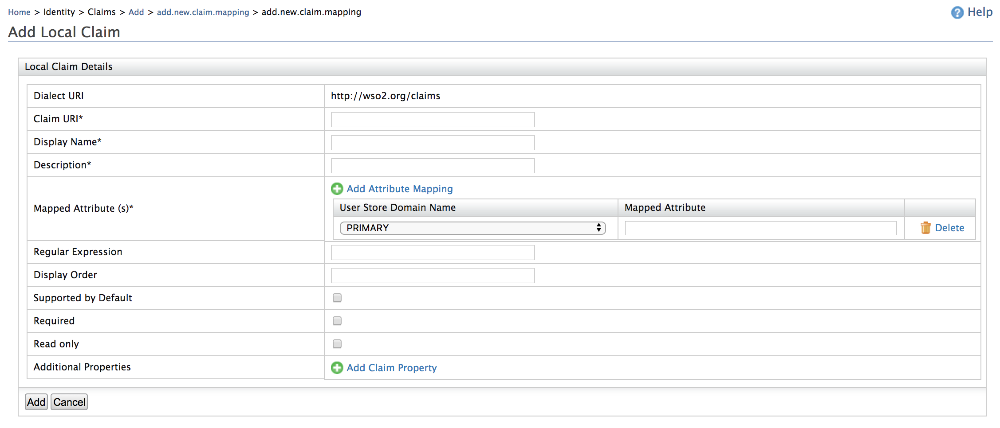
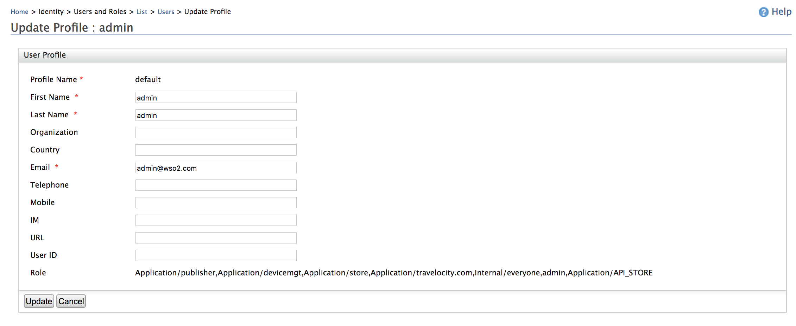
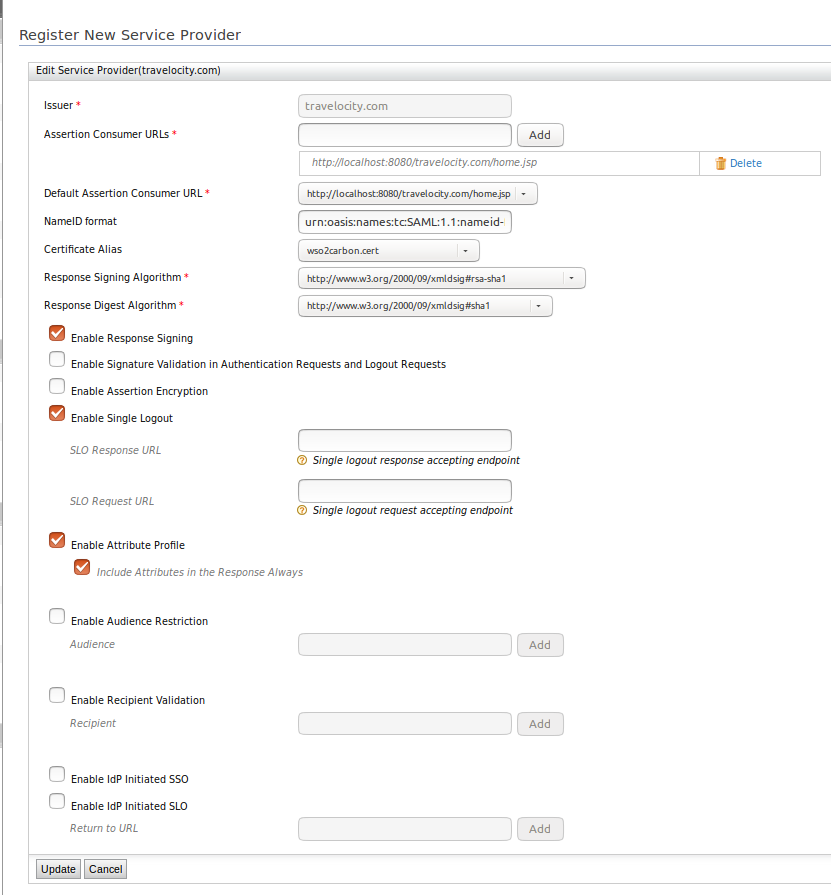
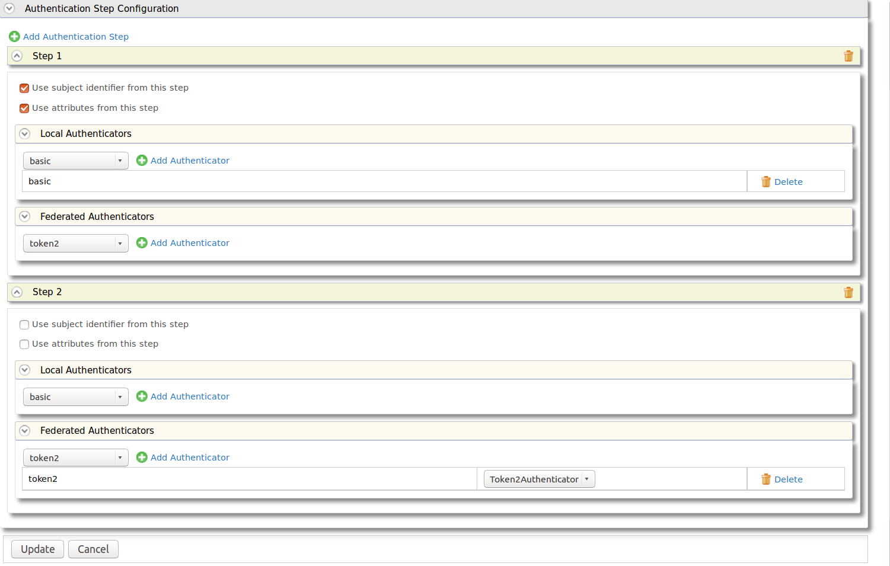
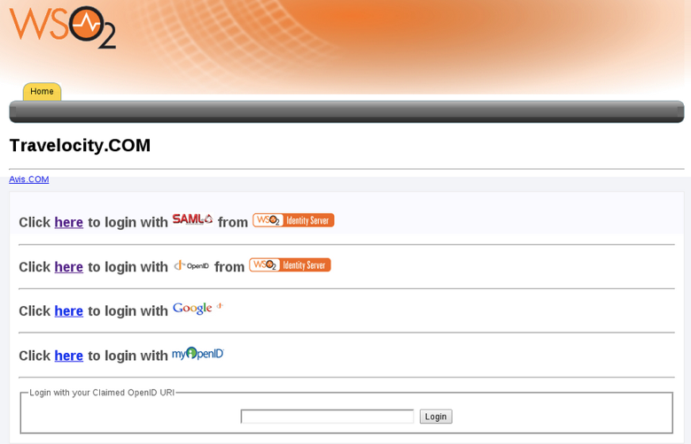
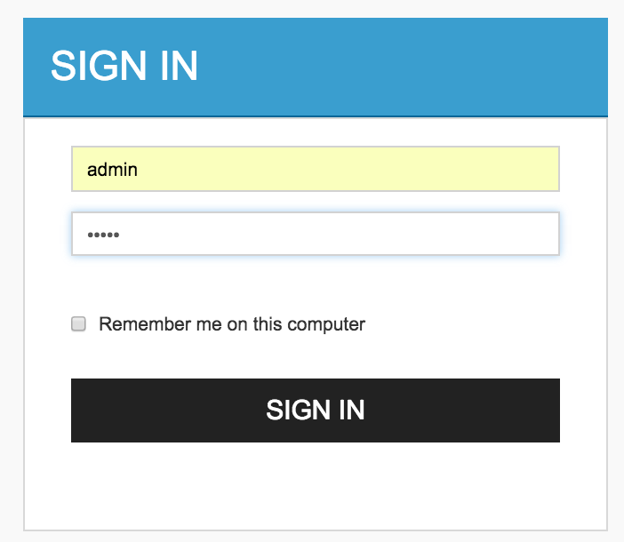
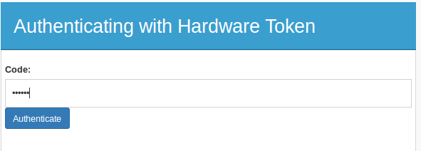
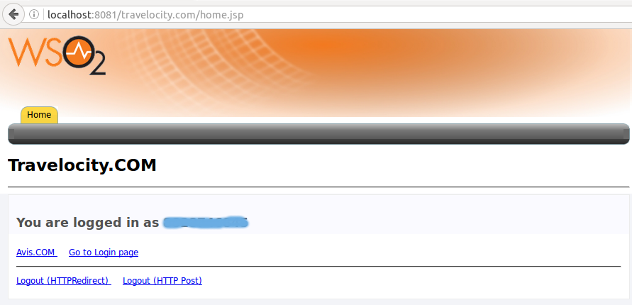

# Configuring Multi-factor Authentication using Token2

This section provides instructions on how to configure the Token2 authenticator and WSO2 Identity Server using a sample app.  See the following sections for more information.
 
 ````
 Token2 Authenticator is supported by WSO2 Identity Server versions 5.1.0 upwards.
 ````
 
* [Deploying Token2 artifacts](#deploying-token2-artifacts)
* [Configuring the Token2 hardware device](#configuring-the-token2-hardware-device)
* [Deploying travelocity.com sample](#deploying-the-travelocitycom-sample-app)
* [Configuring the identity provider](#configuring-the-identity-provider)
* [Configuring user claims](#configuring-user-claims)
* [Configuring the service provider](#configuring-the-service-provider)
* [Testing the sample](#testing-the-sample)


### Deploying Token2 artifacts

The artifacts can be obtained from the [store for this authenticator](https://store.wso2.com/store/assets/isconnector/list?q=%22_default%22%3A%22token2%22).

1. Place the token2authenticationendpoint.war file into the <IS_HOME>/repository/deployment/server/webapps directory.
2. Place the org.wso2.carbon.extension.identity.authenticator.token2.connector-X.X.X.jar file into the 
<IS_HOME>/repository/components/dropins directory.

 >> If you want to upgrade the Token2 Authenticator in your existing IS pack, please refer [upgrade instructions](https://docs.wso2.com/display/ISCONNECTORS/Upgrading+an+Authenticator).   


### Configuring the Token2 hardware device

1. Register a Token2 account using "[https://token2.com/register](https://token2.com/register)". Ensure that you do the following.

    1. Enter the **Mobile phone number** in e164 format (+94 77 ** ** ***) 

    2. Select **SMS Based** as the **User type**.

    3. Click **Register**.


    
   
   

2. Once you have registered with Token2, log in using your email, password and the OTP that is sent to the registered 
mobile number through Token2.

3. Add a new site using "[https://token2.com/manage](https://www.token2.com/manage)" and obtain the API Key and site_id for the site.

4. As mentioned in the [Token2 API page](https://www.token2.com/?content=api), create the user and you can find the userid in the response.

5. You have to obtain the hardware token device and send the userid, site_id and token serial number to Token2 support 
to enable it.

6. Then logout and login again with your email, password and use the token generated in the hardware token device.

You have now enabled the token2 hardware device.

### Deploying the [travelocity.com](https://www.travelocity.com/) sample app
    
The next step is to [deploy the sample app](https://docs.wso2.com/display/ISCONNECTORS/Deploying+the+Sample+App) in order to use it in this scenario.

Once this is done, the next step is to configure the WSO2 Identity Server by adding an [identity provider](https://docs.wso2.com/display/IS510/Configuring+an+Identity+Provider) and a 
[service provider](https://docs.wso2.com/display/IS510).
### Configuring the identity provider
Now you have to configure WSO2 Identity Server by [adding a new identity provider](https://docs.wso2.com/display/IS510/Configuring+an+Identity+Provider).
 1. Download the WSO2 Identity Server from [here](https://wso2.com/identity-and-access-management).
 2. [Run the WSO2 Identity Server](https://docs.wso2.com/display/IS510/Running+the+Product).
 3. Log in to the [management console](https://docs.wso2.com/display/IS510/Getting+Started+with+the+Management+Console) as an administrator.
 4. In the **Identity Providers** section under the **Main** tab of the management console, click **Add**.
 5. Give a suitable name for **Identity Provider Name** (e.g., token2).
 6. Navigate to **Token2Authenticator Configuration** under **Federated Authenticators**.
 7. Select both check boxes to Enable the Token2 authenticator and make it the Default.


 8. Enter the following values: 
 
 | Field| Description | Sample Values |
 | ------------- |-------------| ---------------|
 |ApiKey    | This is the API key you obtained when [configuring the Token2 hardware device](#configuring-the-token2-hardware-device). | 7cf6eof73be1c38952ca81dd68a |
 | Callback URL | This is the service provider's URL to which the code is sent.|[https://localhost:9443/commonauth](https://localhost:9443/commonauth) |

 9. Click **Register**. 
 
    You have now added the identity provider.
    
### Configuring user claims

 1. In the **Main** menu, click **Add** under **Claims**.
 2. Click [Add New Claim](https://docs.wso2.com/display/IS510/Adding+Claim+Mapping).
 3. Click **Add Local Claim**. The **Dialect URI** will be automatically set to http://wso2.org/claims, which is the 
 internal claim dialect. 
 <table> <tbody> 
 <tr> 
 <th>Claim details</th> 
 <th>Description</th>
 <th>Sample Values</th> 
 </tr>
  <tr> 
  <td><b>Claim URI</b></td> 
  <td>This is the URI defined under the dialect, specific to the claim. There are different URIs available in the Identity Server and these equate to user attributes displayed in the profile of users. These URIs are mapped to the attributes in the underlying user store.</td>
  <td>http://wso2.org/claims/identity/userid</td> 
  </tr>
   <tr> 
    <td><b>Display Name</b></td> 
    <td>This is the name of the claim displayed on the UI. This can be viewed in the user's profile by navigating to 
    the <b>Main</b> tab in the management console and clicking <b>List</b> in <b>Users and Roles</b>. In the resulting 
    page, click <b>Users</b> and in the list of users that is displayed, click <b>User Profile</b> next to the one you 
    wish to check.</td>
    <td>User Id</td> 
    </tr>
     <tr> 
      <td><b>Description</b></td> 
      <td>This gives you the option to describe the functionality of the claim.</td>
      <td>Claim to User Id</td> 
      </tr>
       <tr> 
        <td><b>Mapped Attribute</b></td> 
        <td>This is the corresponding attribute name from the underlying user store that is mapped to the Claim URI value. 
            </br></br>When you have multiple user stores connected to the Identity Server, this maps the equivalent 
            attribute in all of them to the Claim URI you are configuring. 
            For example, if you specify the cn attribute, this is mapped to the cn attribute in all the connected user stores. If you want to specify the attribute in a specific user store, you must add the domain name in addition to the mapped claim. For example, in a scenario where you have a primary user store configured called PRIMARY and secondary user stores called AD (representing Active Directory), you can map an attribute from each of these user stores to the Claim URI value by clicking Add Attribute Mapping, selecting the respective user store from the drop-down list, and mentioning the attribute of the userstore the attribute needs to be mapped to.
            Example:</br>
            
 
            </td>
        <td>stateOrProvinceName</td> 
        </tr>
         <tr> 
          <td><b>Regular Expression</b></td> 
          <td>This is the regular expression used to validate inputs. Example : For a claim URI like [http://wso2
          .org/claims/email](http://wso2.org/claims/email) the regex should be something like <b>^([a-zA-Z0-9_\-\.]+)@
          ([a-zA-Z0-9_\-\.]+)\.
          ([a-zA-Z]{2,5})$</b> .This will validate the claim value and will not let other values except an email.</td>
          <td></td> 
          </tr>
           <tr> 
            <td><b>Display Order</b></td> 
            <td>This enables you to specify the order in which the claim is displayed, among the other claims defined under the same dialect.</td>
            <td></td> 
            </tr>
             <tr> 
              <td><b>Supported by Default</b></td> 
              <td>If unchecked, this claim will not be prompted during user registration.</td>
              <td></td> 
              </tr>
               <tr> 
                <td><b>Required</b></td> 
                <td>This specifies whether this claim is required for user registration.</td>
                <td></td> 
                </tr>
                <tr> 
                <td><b>Read-only</b></td> 
                <td>This specifies whether the claim is read-only or not. If the claim is read-only, it can't be updated by the user.</td>
                <td></td> 
                </tr>
                <tr> 
                <td><b>Additional Properties</b></td> 
                <td>These properties are not currently used in current WSO2 Identity server. If we need to write an extension using current claims, we can use these property values.</td>
                <td></td> 
                </tr>
 </tbody> </table>
 
  
  
 4. Next click **List** under **Main > Identity > Users and Roles**.
  
 5. Click **User Profile** under **Admin** and update the User Id. 
 
 
 
 Now you have configured the claim.
 
 ### Configuring the service provider
 
 The next step is to configure the service provider.
 
 1. Return to the management console.
 2. In the **Identity** section under the **Main** tab, click **Add** under **Service Providers**.
 3. Enter **travelocity.com** in the **Service Provider** Name text box and click **Register**.
 4. In the **Inbound Authentication Configuration** section, click **Configure** under the 
 **SAML2 Web SSO Configuration** section.
 
 
 The following table includes the definition of the parameters and their values :
 
  <table> <tbody> 
  <tr> 
  <th>Field</th> 
  <th>Description</th>
  <th>Sample Values</th> 
  </tr>
   <tr> 
   <td><b>Issuer</b></td> 
   <td>Specify the <b>Issuer</b>. This is the <saml:Issuer> element that contains the unique identifier of the service 
   provider. This is also the issuer value specified in the SAML Authentication Request issued by the service 
   provider. When configuring single-sign-on across Carbon servers, ensure that this value is equal to the 
   <b>ServiceProviderID</b> value mentioned in the <IS_HOME>/repository/conf/security/authenticators.xml file of the 
   relying party Carbon server.</td>
   <td>travelocity.com</td> 
   </tr>
   <tr> 
       <td><b>Default Assertion Consumer URL</b></td> 
       <td>Since there can be multiple assertion consumer URLs, you must define a Default <b>Assertion Consumer URL</b>
        in case you are unable to retrieve it from the authentication request.


````
Tip: 

In a service provider initiated single sign-on setup, the following needs to be considered.
        
   * If no ACS URL is given in the <AuthnRequest>, the Identity Server sends the response to the default ACS URL 
     of the service provider (whether the request is signed or not).
   * If the ACS URL in <AuthnRequest> matches with one of the registered URLs, the Identity Server sends the 
     response to the matched one. 
   * If the ACS URL in <AuthnRequest> does not match any of the registered ACS URLs and if the request is signed, 
     the Identity Server sends the response to the ACS URL in the request only if the signature is valid.Alternatively, the <AuthnRequest> is rejected.

In an identity provider initiated single sign-on setup, the following needs to be considered.
       
   * If the “acs” query parameter is not present in the request, the Identity Server sends the response to default 
     ACS URL of the service provider.
   * If the "acs” parameter is present and the value of that parameter matches with any of the registered ACS URLs
     of the service provider, then the Identity Server sends the response to the matched one.
````       


</td>
<td>http://wso2is.local:8080/travelocity.com/home.jsp</td> 
       </tr>
        <tr> 
            <td><b>Assertion Consumer URLs</b></td> 
            <td>Specify the <b>Assertion Consumer URLs</b>. This is the URL to which the browser should be redirected to after
             the authentication is successful. This is the Assertion Consumer Service (ACS) URL of the service provider. The
              identity provider redirects the SAML2 response to this ACS URL. However, if the SAML2 request is signed and 
              SAML2 request contains the ACS URL, the Identity Server will honor the ACS URL of the SAML2 request. It should
               have this format: <b>https://(host-name):(port)/acs</b>. You can add multiple assertion consumer URLs for the 
               service provider by entering the URL and clicking the **Add** button.</td>
            <td>http://wso2is.local:8080/travelocity.com/home.jsp</td> 
            </tr>
        <tr> 
         <td><b>NameID format</b></td> 
         <td>Specify the <b>NameID format</b>. This defines the name identifier formats supported by the identity 
         provider. The service provider and identity provider usually communicate with each other regarding a specific subject. That subject should be identified through a Name-Identifier (NameID) , which should be in some format so that It is easy for the other party to identify it based on the format. Name identifiers are used to provide information regarding a user. 


````
info:

About NameID formats

For SSO interactions, you can use the following types of NameID formats.

    * urn:oasis:names:tc:SAML:2.0:nameid-format:persistent
    * urn:oasis:names:tc:SAML:2.0:nameid-format:transient
    * urn:oasis:names:tc:SAML:1.1:nameid-format:
    * emailAddressurn:oasis:names:tc:SAML:1.1:nameid-format:unspecified
    * urn:oasis:names:tc:SAML:1.1:nameid-format:X509SubjectName
    * urn:oasis:names:tc:SAML:1.1:nameid-format:WindowsDomainQualifiedName
    * urn:oasis:names:tc:SAML:2.0:nameid-format:kerberos
    * urn:oasis:names:tc:SAML:2.0:nameid-format:entity

This specifies the name identifier format that the Identity Server wants to receive in the subject of an assertion from a particular identity provider. The following is the default format used by the identity provider.

    * urn:oasis:names:tc:SAML:1.1:nameid-format:emailAddress

````

 </td>
 <td>urn:oasis:names:tc:SAML:1.1:nameid-format:emailAddress</td> 
 </tr>
 <tr> 
           <td><b>Certificate Alias</b></td> 
           <td>Select the <b>Certificate Alias</b> from thedropdown. This is used to validate the signature of SAML2 
           requests and is used to generate encryption.Basically the service provider’s certificate must be selected here. Note that this can also be the Identity Server tenant's public certificate in a scenario where you are doing atenant specific configuration.
           </td>
           <td>wso2carbon</td> 
           </tr>
            <tr> 
             <td><b>Response Signing Algorithm</b></td> 
             <td>Specifies the ‘SignatureMethod’ algorithm to be used in the ‘Signature’ element in POST binding. The
              default value can be configured in the <IS_HOME>/repository/conf/identity.xml file, in the SSOService 
              element with SAMLDefaultSigningAlgorithmURI tag. If it is not provided the default algorithm is RSA­SHA
               1, at URI <b>http://www.w3.org/2000/09/xmldsig#rsa­sha1</b>.</td>
             <td>http://www.w3.org/2000/09/xmldsig#rsa­sha1</td> 
             </tr>
              <tr> 
               <td><b>Response Digest Algorithm</b></td> 
               <td>Specifies the ‘DigestMethod’ algorithm to be used in the ‘Signature’ element in POST binding. The 
               default value can be configured in the <IS_HOME>/repository/conf/identity.xml file, in the SSOService 
               element with SAMLDefaultDigestAlgorithmURI tag. If it is not provided the default algorithm is SHA 1, 
               at URI <b>http://www.w3.org/2000/09/xmldsig#sha1</b>.</td>
               <td>http://www.w3.org/2000/09/xmldsig#sha1</td> 
               </tr>
                <tr> 
                 <td><b>Enable Response Signing</b></td> 
                 <td>Select <b>Enable Response Signing</b> to sign the SAML2 Responses returned after the 
                 authentication process.</td>
                 <td>Selected</td> 
                 </tr>
                 <tr> 
                 <td><b>Enable SignatureValidation inAuthentication Requests and Logout Requests </b></td> 
                 <td>Select <b>Enable Signature Validation in Authentication Requests and Logout Requests</b> if you 
                 need this functionality configured. This specifies whether the identity provider must validate the signature of the SAML2 authentication request and the SAML2 logout request thatare sent by the service provider.</td>
                 <td>Unselected</td> 
                 </tr>
                 <tr> 
                 <td><b>Enable Assertion Encryption</b></td> 
                 <td>Enable <b>Assertion Encryption</b>, if you wish to encrypt the assertion.</td>
                 <td>Unselected</td> 
                 </tr>
                  <tr> 
                  <td><b>Enable Single Logout</b></td> 
                  <td>Select <b>Enable Single Logout</b> so that all sessions are terminated once the 
                                  user signs out from one server. If single logout is enabled, the identity provider 
                                  sends logout requests to all service providers. Basically, the identity provider 
                                  acts according to the single logout profile. If the service provider supports a 
                                  different URL for logout, you can enter a <b>SLO Response URL</b> and <b>SLO Request 
                                  URL</b> for logging out. These URLs indicate where the request and response should go 
                                  to. If you do not specify this URL, the identity provider uses the Assertion Consumer Service (ACS) URL. </td>
                  <td>Selected</td> 
                  </tr>
                  <tr> 
                  <td><b>Enable Attribute Profile </b></td> 
                  <td>Select <b>Enable Attribute Profile</b> to enable this and add a claim by entering the claim link 
                  and clicking the <b>Add Claim</b> button. The Identity Server provides support for a basic attribute 
                  profile where the identity provider can include the user’s attributes in the SAML Assertions
                   as part of the attribute statement. Once you select the checkbox to <b>Include Attributes in the 
                   Response Always</b>, the identity provider always includes the attribute values related to the 
                   selected claims in the SAML attribute statement.</td>
                  <td>Unselected</td> 
                  </tr>
                   <tr> 
                   <td><b>Enable Audience Restriction</b></td> 
                   <td>Select <b>Enable Audience Restriction</b> to restrict the audience. You may add audience members 
                   using the <b>Audience</b> text box and clicking the <b>Add</b> button.</td>
                   <td>Unselected</td> 
                   </tr>
                   <tr> 
                  <td><b>Enable Recipient Validation </b></td> 
                  <td>Select this if you require validation from the recipient of the response.</td>
                  <td>Unselected</td> 
                  </tr>
                  <tr> 
                  <td><b>Enable IdP Initiated SSO</b></td> 
                  <td>Select the <b>Enable IdP Initiated SSO</b> checkbox to enable this functionality. When this is 
                  enabled, the service provider is not required to send the SAML2 request. </td>
                  <td>Unselected</td> 
                  </tr>
                  <tr> 
                  <td><b>Enable IdP Initiated SLO</b></td> 
                  <td>Select the <b>Enable IdP Initiated SLO </b>checkbox to enable this functionality. You must 
                  specify the URL.</td>
                  <td>Unselected</td> 
                  </tr>
                  <tr> 
                  <td><b>Enable Assertion Query Request Profile</b></td> 
                  <td>Select the Enable Assertion Query Request Profile checkboxto query assertions that are 
                  persisted to the database when you loginto the service provider application. For more information, 
                  see 
             
 [Querying SAML Assertions](https://docs.wso2.com/display/IS530/Querying+SAML+Assertions).
                  </td>
                  <td>Unselected</td> 
                  </tr>
  </tbody> </table>
  
5. Now set the configuration as follows:

    * **Issuer**: [travelocity.com](http://travelocity.com)
    * **Assertion Consumer URL**: [http://localhost:8080/travelocity.com/home.jsp](http://localhost:8080/travelocity.com/home.jsp )

6. Select the following check-boxes:

    * **Enable Response Signing**
    * **Enable Single Logout**
    * **Enable Attribute Profile**
    * **Include Attributes in the Response Always** 
    
7. Click **Update** to save the changes. Now you will be sent back to the Service Providers page.

8. Go to **Claim configuration** and select the userId claim as Subject Claim URI.
 
  
 
 9. Go to **Local and Outbound Authentication Configuratio**n section.
 
 10. Select the **Advanced configuration** radio button option .
 11. Add the **basic** authentication as a first step and **token2** authentication as a second step. This is done to 
 configure multi-step authentication. What this means is that a user who logs in would first have to enter their credentials that are configured with the Identity Server and then get authenticated using Token2 as the second step. This is an added security measure and a common use of the Token2 authenticator.
 
 
 
 The following table includes the field definitions
 
 <table> <tbody>
  <tr> <th>Authentication Type</th> <th>Details</th> </tr>
  <tr> <td>Default</td> <td>This is the default authenticator sequence for a configured service provider in the Identity Server. This sequence can be modified by updating following section in the <IS_HOME>/repository/conf/identity/application-authentication.xml file.
   
  ````
          <Sequences>
              <!-- Default Sequence. This is mandatory -->
              <Sequence appId="default">
                  <Step order="1">
                      <Authenticator name="BasicAuthenticator"/>
                  </Step>
              </Sequence>
          </Sequences>
  ````
   </td> </tr>
   <tr> 
   <td>LocalAuthentication</td> 
   <td>
   In this case, Identity Server itself authenticate the user. There are three types of local authenticators OOTB in a fresh Identity Server pack.
   
   * The <b>basic</b> authenticator is used to authenticate the user using the credentials available in the Identity 
   Server.
   * <b>IWA</b> stands for Integrated Windows Authentication and involves automatically authenticating users using their 
   Windows credentials.
   * <b>FIDO</b> authenticator is a local authenticator that comes with the WSO2 Identity Server. This will handle FIDO 
   authentication requests related key validation against stored keys, the public key,keyhandler, and the counter, attestation certificate of FIDO registered users.</td> </tr>
  <td>FederatedAuthentication</td>
 <td>
 In this case, Identity Server trust third-party Identity provider to perform the user authentication. These Identity providers use various protocols to transfer authentication/authorization related messages. Currently, the Identity Server only supports the following federated authenticators OOTB.
 
 * SAML2 Web SSO
 * OAuth2/OpenID Connect
 * WS-Federation (Passive)
 * Facebook
 * Microsoft (Hotmail, MSN, Live)
 * Google
 * SMS OTP
 * Email OTP
 * Twitter
 * Yahoo
 * IWA Kerberos
 * Office365
 </td>
 </tr>
 <tr>
 <td>Advanced Configuration</td>
 <td>Advanced configurations enable you to add multiple options or steps in authentication. When multiple 
 authentication steps exist, the user is authenticated based on each and every one of these steps. If only one step 
 is added then the user is only authenticated based on the local and/or federated authenticators added in a single 
 step. However, in the case of local and/or federated authenticators, the authentication happens based on any one of 
 the available authenticators.</td>
 </tr>
 </tbody> </table>
 
 You have now added and configured the service provider.
 
 ### Testing the sample
 
 1. To test the sample, go to the following URL: [http://localhost:8080/travelocity.com](http://localhost:8080/travelocity.com ) 
    
    
 2. Click the link to log in with SAML from WSO2 Identity Server.

    
 3. Basic authentication page will be visible, use your IS username and password.

    
    
 4. Enter the code that is generated with token2 hardware device to authenticate.
    

5. If the authentication is successful, you will be taken to the home page of the [travelocity.com](https://www.travelocity.com/) app.



